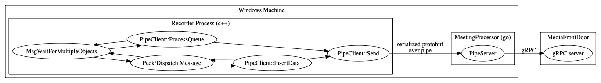

# Table of Contents

0.  [Build instructions](#orgfc1f76a)
1.  [What Does It Do?](#orgfc1f76d)
2.  [How To Run This?](#orgf877bad)
    1.  [Recording](#org415edb6)
    2.  [Dependency](#org5a62a3c)
    3.  [Hack](#org1f31c89)
    4.  [Command Line Parameters](#org43dba57)
3.  [Status of This App](#org716018c)
4.  [Code Structure](#orgfc392c0)
5.  [Data Flow](#org22bb29e)
6.  [How To View Recordings](#org0b7beb1)
7.  [Extra Info](#org714cb0e)

Zoom has many different client SDKs, among all available one, the only thing
that we could possibly use on a cloud setup is the Windows SDK. This project is
a modified version of the original SDK under demo/sdk\_demo, and renamed as
*recorder*.

# Build instructions
1. Install [VS Code](https://code.visualstudio.com/)
2. Install [VS Toolchain 2017/2019](https://visualstudio.microsoft.com/thank-you-downloading-visual-studio/?sku=BuildTools&rel=16). Be sure to install desktop workflow (for both 2017 and 2019 build tools)
3. Open visual studio command prompt for x86 target
4. Open VSCode in project directory from aforementioned command propmt
5. Install [C/C++ Extension from Microsoft](https://marketplace.visualstudio.com/items?itemName=ms-vscode.cpptools)
6. Install [CMake Tools Extension](https://marketplace.visualstudio.com/items?itemName=ms-vscode.cmake-tools)
7. (Optional)Install CMake language extension to your preference
8. Use extension pane from step 6 to build for a given config (x86 target, debug/release config)
9. Run install target (find ready to use zoom_bot.exe under build/output/zoom_bot.exe folder)

# What Does It Do?

This is a windows application which does the following:

-   join a conference with a given ID
-   start to tap into audio and video streams once the meeting starts
-   TODO: open a Win32 pipes (shared memory) to communicate with recording process
    which does the video composition as well as H264 encoding.
-   once meeting ends, the process should just die

# How To Run This?

This is built with Visual Studio 2019. Please note that only **Release** version
built. (Same as the original demo/sdk\_\_demo). To run this, just open
zoom-recorder.sln and run from there. Once successfully built, a binary will be
dropped to bin/ folder.

## Recording

The recording capability is done with a unpublished RAW data access API that we
got from Zoom development team. Currently, it&rsquo;s not possible to run this with a
corp account (That&rsquo;s a bug that they are trying to address). So for now, please
use the credential specified in the sln file.

## Dependency

-   This depends on files under bin/. Please note that you can&rsquo;t run both
    recorder/ and demo/sdk\_\_demo at the same time, as they both will try to modify
    files under bin/ and causes random crashes.
-   There is no requirement of having a mic or camera at all.

## Hack

In the original SDK, there is a limitation that a single machine can only run
one instance of SDK. What they did was to create a global named event and
detected if it exists already. Based on my understanding, container has no its
own kernel object namespace (I could be wrong on this one). So the only way for
us to run this is to have a single VM to run one SDK. VM preparation is usually
on demand, but can take couple minutes based on my experience with azure. So I
implemented a hack which is to kill this Event handle during the process
initialization phase. This so far works well and allows us to run multiple SDK
instances on a given machine. (Although we do have to wait one instance
finishing initialization before we start another one)

## Command Line Parameters

This tool supports a rich set of command line options. Many of them are added
during the phase when I don&rsquo;t fully understand zoom&rsquo;s authentication model. I
believe at the time when we need to go production, we will have to use
username/password of a given user which has the special RAW api privilege turned on.

# Status of This App

-   Currently, this will write file to c:\temp\audio.bin, video.bin, and
    video.meta. (Please pre-create this folder)
-   The code quality is for prototyping. So there are still a bit work to be done
    to make it production quality. However, since this is NOT a long running

# Code Structure

-   Main.cpp has a window message loop which is required as the underneath Zoom
    SDK is a UX app. Most of our code changes happen in *MeetingServiceMgr.cpp*
-   I suggest to follow the [ClangFormat](https://clang.llvm.org/docs/ClangFormat.html) for code under this project

# Data Flow

Since the whole Zoom native app runs on the single thread, we&rsquo;ll have to use
that thread to handle both windows message as well as the IO. The flow will be

-   When the zoom recorder starts, it&rsquo;ll CreateFile on an existing named pipe
-   The main thread will wait through MsgWaitForMultipleObject(MWMO) to be able to
    process windows message as well as the Overlapped IO event. Note that MWMO can
    only handle up to 64 handles
-   when a audio/video frame is given, if previous IO has been done, it&rsquo;ll do
    overlapped WriteFile() on that named pipe with an event. Otherwise, it&rsquo;ll be
    queued.
-   MWMO will be waked up when the IO is done, if there is queued data, it&rsquo;ll
    start to process the queue.

For future compatibility, we&rsquo;ll use a protobuf definition to define the data
exchange between the Zoom native recorder and the meeting processor. The
protobuf will be serialized and deserialized by these 2 processes.

# How To View Recordings

-   For audio, it&rsquo;s recorded as 32k, single channel, PCM data. I have used
    Audacity to listen to the file
-   For video, I use [PYUV](http://dsplab.diei.unipg.it/software/pyuv_raw_video_sequence_player) to view the recording. The format is YUV, 420, 640X480

I have verified both work.

# Extra Info

-   Please see [ZOOM original README](https://github.com/zoom/zoom-sdk-windows/blob/master/README.md)
-   We&rsquo;ll use jira to track any work items, there are still many. Will update the
    README once set up.
